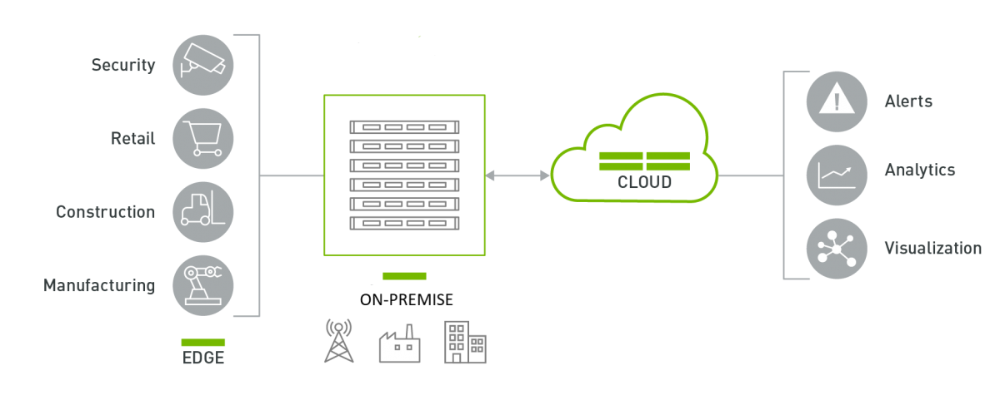
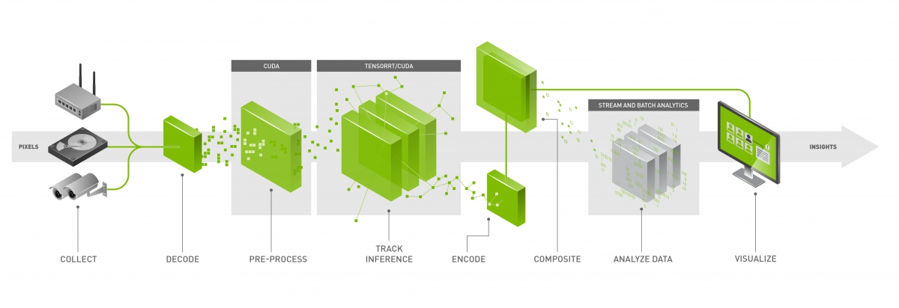
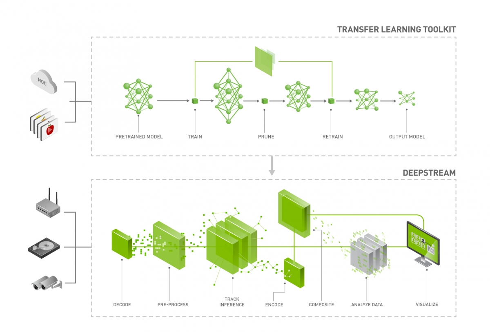
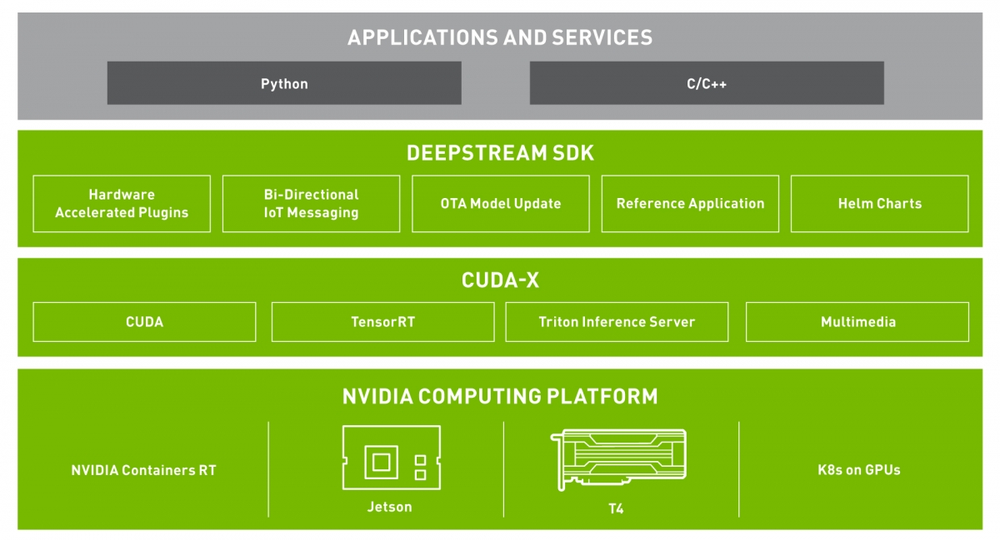

# 简介

## 什么是DeepStream ？

`DeepStream`是用于**构建(build)**和**部署(deploy)**基于**AI**的`IVA`，即`智能视频分析应用及服务框架(Intelligent Video Analytics apps and services Framework)`。

### 技术诞生的背景

全世界有数十亿台`摄像机(camera)`和`传感器(sensors)`，它们正捕获着大量的数据。

这些数据可以被用于：

* 生成业务见解(business insights)，以提高整个业务流程的效率并提高收入流(revenue streams)
* 在道路交叉口来减少车辆拥堵
* 在医院进行健康与安全监控
* 在零售店的过道进行客户满意度调查(surveying)
* 运动分析(sports analytics)
* 制造工厂的设备上进行组件的缺陷检测

然而，所有这些应用都需要**可靠的**`实时只能视频分析（real-time Intelligent Video Analytics）`。

`DeepStream`提供了一个多平台可扩展的框架，并且支持使用`TLS安全协议`来部署到`边缘设备(edge)`或是连接到任何`云端(cloud)`。

### DeepStream工作流

## 性能Baseline

通过`TLT(Transfer Learning Toolkit)`，使用`DeepStream SDK`来部署`专用模型(purpose-built models)`可以提升端到端的吞吐量：

|                        |                      |           |                | **Jetson Nano** | **Jetson Xavier NX** |            |            | **Jetson AGX Xavier** |            |            | **T4**    |
| :--------------------- | :------------------- | :-------- | :------------- | :-------------- | :------------------- | :--------- | :--------- | :-------------------- | :--------- | :--------- | :-------- |
| Model Architecture     | Inference Resolution | Precision | Model Accuracy | GPU (FPS)       | GPU (FPS)            | DLA1 (FPS) | DLA2 (FPS) | GPU (FPS)             | DLA1 (FPS) | DLA2 (FPS) | GPU (FPS) |
| PeopleNet-ResNet34     | 960x544              | FP16      | 84%            | 10              | 60                   | 30         | 30         | 120                   | 60         | 60         | 460       |
| TrafficCamNet-ResNet18 | 960x544              | INT8      | 83.5%          | 19*             | 180                  | 90         | 90         | 420                   | 120        | 120        | 1300      |
| DashCamNet-ResNet18    | 960x544              | INT8      | 80%            | 18*             | 180                  | 90         | 90         | 390                   | 120        | 120        | 1280      |
| FaceDetect-IR-ResNet18 | 384x240              | INT8      | 96%            | 95*             | 1080                 | 570        | 570        | 1950                  | 780        | 780        | 2160      |

**说明**：_以上数据是在`1080p`的输入下测试的`FPS`。_

**提示**：_FP16 inference on Jetson Nano Running on the DLAs for AGX Xavier and NX frees up GPU for other tasks。_

## DeepStream体系结构

`DeepStream`提供了一套完备的`流分析工具包(streaming analytics toolkit)`：

**提示**：_DeepStream is also an integral part of [NVIDIA Metropolis](https://www.nvidia.com/en-us/autonomous-machines/intelligent-video-analytics-platform/), the platform for building end-to-end services and solutions that transform pixel and sensor data to actionable insights._

