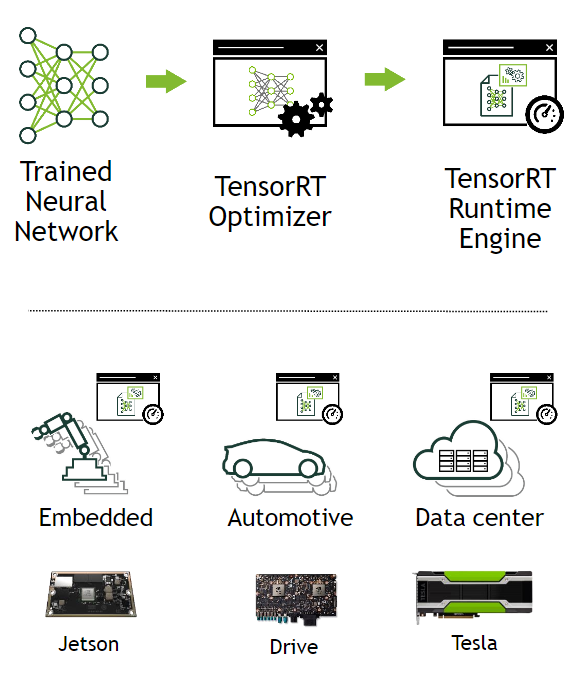
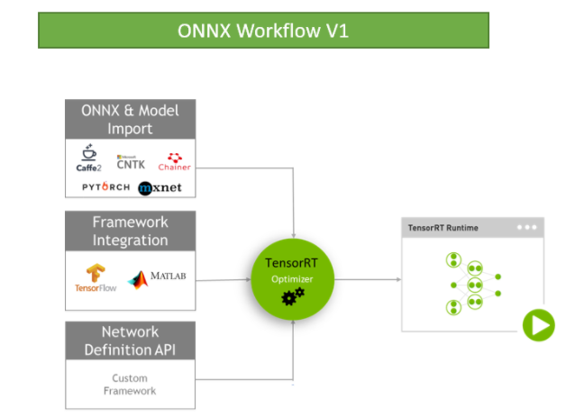

# 简介

## 什么是TensorRT ？

​	`Nvidia TensorRT`的`核心`是一个`C++库`，用于在`Nvidia GPUs`上进行高性能`推理（inference）`。

​	它的设计初衷是与`训练框架`（例如：`TensorFlow`、`Caffe`、`PyTorch`和`MXNet`等）进行互不。由`训练框架`进行网络的训练，而`TensorRT`则致力于在`GPU`上快速有效的运行`经过训练的网络`，以便尽可能快速的得到`网络结果`（根据场景不同，这个过程也被称作：`评分（scoring）`、`检测（detecting）`、`回归（regression）`或`推理（inference）`）。

​	下图非常直观的展示了它的用处：我们将`已经训练好的神经网络`交给`优化器（Optimizer）`，最终我们会生成一个经过了高度优化的`运行时引擎（Runtime Engine）`。

​	最终投入生产的时候，也无需再使用`训练框架`进行`推理`，我们生成的这个`运行时引擎`会负责进行高效的`推理`，尽可能的挖掘出`GPU`的推理潜力。

## What is TensorRT

## Where Does TensorRT Fit

