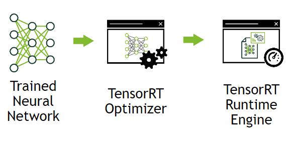
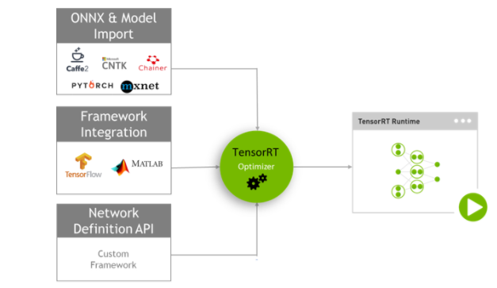

# 简介

## 什么是TensorRT ？

`Nvidia TensorRT`的`核心（Core）`是一个`C++库`，用于在`Nvidia GPUs`上进行高性能`推理（inference）`。

它的设计初衷是与`训练框架`（例如：`TensorFlow`、`Caffe`、`PyTorch`和`MXNet`等）进行互补。由`训练框架`进行网络的训练，而`TensorRT`则致力于在`GPU`上快速有效的运行`经过训练的网络`，以便尽可能快速的得到`网络结果`（根据场景不同，这个过程也被称作：`评分（scoring）`、`检测（detecting）`、`回归（regression）`或`推理（inference）`）。

### 工作方式

下图非常直观的展示了它的用处：我们将`已经训练好的神经网络`交给`优化器（Optimizer）`，最终我们会生成一个经过了高度优化的`运行时引擎（Runtime Engine）`。

最终投入生产的时候，也无需再使用`训练框架`进行`推理`，我们生成的这个`运行时引擎`会负责进行高效的`推理`，尽可能的挖掘出`GPU`的推理潜力。因此，只需要部署这个轻量级的高速推理引擎即可。

### 与"框架无关"且"特定于设备"的优化

`TensorRT`支持目前所有主流的`深度学学习框架`（尤其是与`TensorFlow`和`Caffe`高度兼容），通常情况下总能找到一个适合的优化方案。

但是`TensorRT`对于`运行设备与环境`的要求是“**严格的**”，针对某一“设备”进行优化所生成的`推理引擎`，直接放在“其他设备”（具体指不同的`执行环境`和`硬件环境`）上运行，并不一定能起到加速效果，反而在实践中往往比直接使用`训练框架`速度还要慢。

下图所表达的就是：`TensorRT`可以支持多种框架，但是生成的优化是针对当前设备而言的。

### 适用场景

通常有三类场景（排名不分先后）尤其适合`TensorRT`发挥专长，下图展示这三类场景的典型案例：

* 低性能设备环境

  通常，`嵌入式设备`或`微型设备`的算力都较为低下。

  以`机器视觉`方向为例，通常的解决方案是将`主干网络（Backbone）`换成类似于`MobileNet`这样更加轻量级的`卷积神经网络`，但是这是以牺牲`精度性能`为代价的。

  相比至下，`TensorRT`所带来的免费（指几乎不牺牲`精度性能`）的性能提升，可以让更大型的网络运行在这些小型设备上得以运行。

* 高实时性要求的业务场景

  `自动驾驶（Automotive）`是一个典型的`实时性任务`（更多的是出于安全的考虑），它要求推理时间应该尽可能的短。此时，即使使用`C++ API`来编写`应用程序`也无法突破`训练框架API`本身的性能瓶颈，因为`训练框架`为了实现其“通用性”和“自动微分计算”等高级功能，无法在设备层次进行进一步的优化。

* 高运算负载的业务场景

  `计算中心`通常需要处理来自多台`客户端设备`的计算请求，此时除了使用`集群计算架构`以外，`TensorRT`优化也能为`计算中心`赋能。此类场景也适用于`单设备`同时运行`多模型`的情况。

## TensorRT是如何优化性能的 ？

`TensorRT`主要通过`合并多个层（combining layers）`（也称为`压缩网络（compressed network）`）和`优化内核的选择（optimizing kernel selection）`来改善`延时（latency）`、`吞吐量（throughput）`、`能效（power efficiency）`和`内存消耗（memory consumption）`。

下图展示了`TensorRT`进行性能优化的主要途径：

* 层融合与张量融合（Layer & Tensor Fusion）

* 自动调节的核（Kernel Auto-Tuning）

* 动态张量内存（Dynamic Tensor Memory）

* 多流执行（Multi-Stream Execution）

* 精度调校（Precision Calibration）

  `TensorRT`会根据指定的`精度`（例如：`FP32`、`FP16`或`INT8`等）来`组合层`、`优化内核选择`、进行`规范化（normalization）`并转换为`经过优化的矩阵计算`。

### 低精度推理

如果`应用程序`需要，可以要求以`低精度（lower precision）`来运行网络（最好先进行可行性评估），以此来进一步提升性能并降低需要的内存。

## 适配方案

下图所展示的是：为了支持将`特定的网络模型`转换为`TensorRT运行时`，根据`训练框架`的不同分为了如下几组方案：

* TensorFlow集成与MatLab集成
* Tensorflow与Caffe的转换API
* ONNX转换API（适用于`PyTorch`等其他主流框架）
* 自定义网络结构API（针对darknet这种框架）

